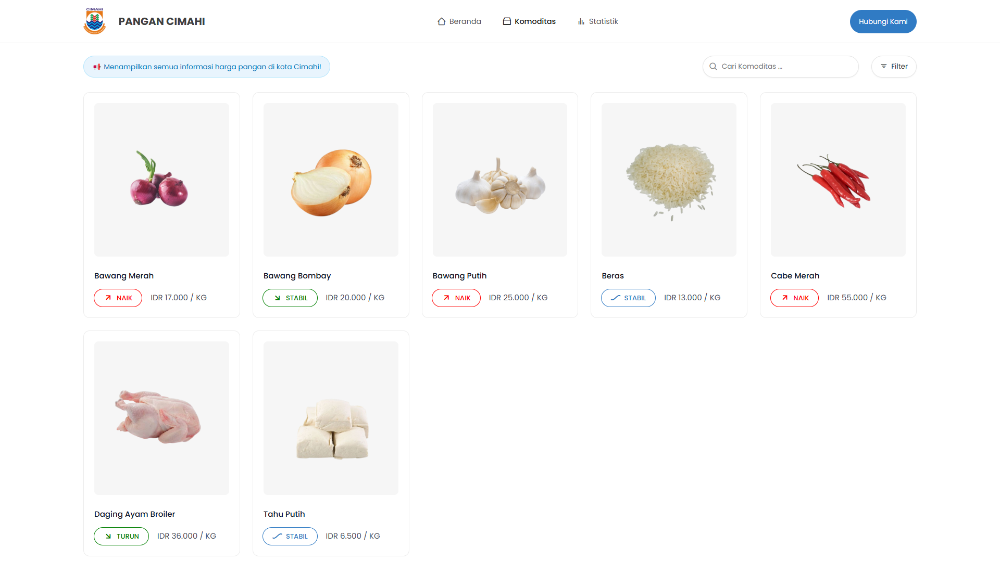

# 🌾 SiHaPaCi - Sistem Informasi Harga Pangan Cimahi

**SiHaPaCi** (Sistem Informasi Harga Pangan Kota Cimahi) adalah platform untuk memantau harga pangan di Kota Cimahi.



---

## 🔧 Fitur Utama

- 📊 Tampilkan harga harian komoditas pangan
- 🗂️ Komoditas
- 🔎 Fitur pencarian & filter
- 🧑‍🌾 Akses mudah untuk masyarakat umum
- 📱 Desain responsif (mobile-friendly)

---

## 🚀 Instalasi

```bash
git clone https://github.com/fahmirzl/sihapaci.git
cd sihapaci
# pindahkan folder ini ke direktori web server (misalnya /htdocs atau /www)
# pastikan web server (XAMPP/Laragon/dll) sudah aktif
# sesuaikan port jika perlu (misalnya http://localhost:8080/sihapaci/)
```

---

## ✨ Kontribusi

Pull request terbuka untuk perbaikan bug, dokumentasi, atau fitur tambahan.
